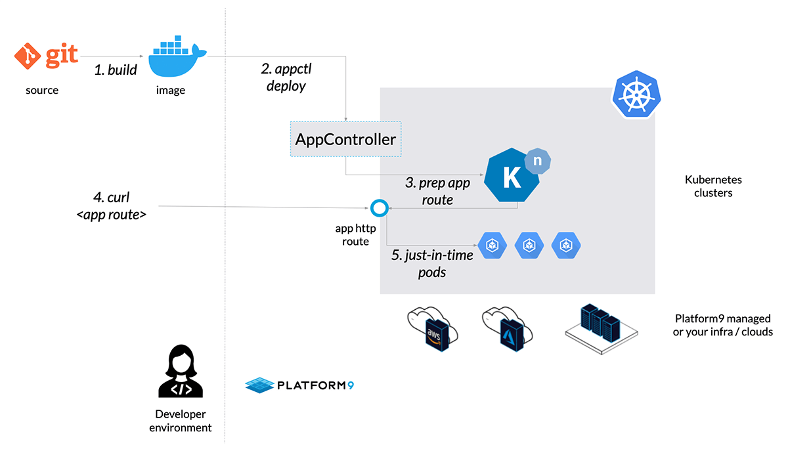
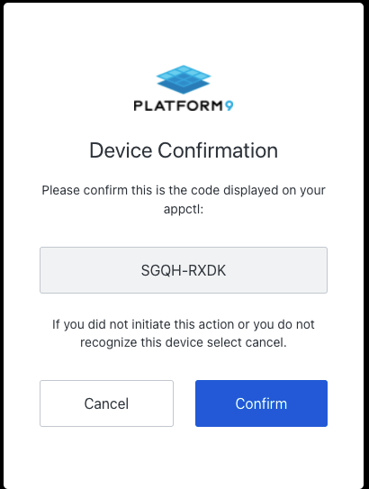
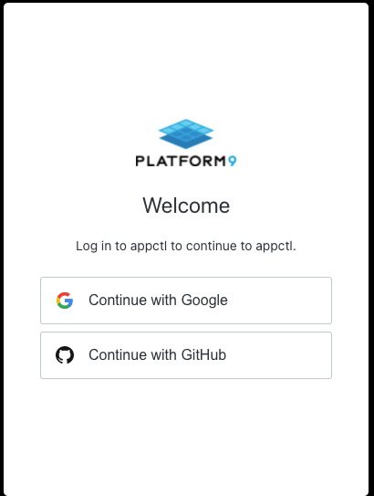

# appctl
**Run apps, Not Clusters.** Deploy your app on kubernetes in seconds,with no clusters required. Check for more information at https://platform9.com/appctl/

* Read the docs: [getting started with appctl](https://platform9.com/docs/appctl/getting-started)


### Purpose
* Appctl is a CLI that can be installed on Windows, MacOS and Linux, which connects to a Platform9 Managed Kubernetes Cluster running in AWS and enables users to deploy containerized applications in seconds.

### A better way to run apps on K8s
*  **Appctl** exposes the high value app orchestration capabilities available from Kubernetes and k-native, while hiding infrastructure complexity. 

* As a result, it is much faster to run apps while also running them more cost effectively in the cloud

### How appctl works


### Pre-requisites
The CLI currently supports
* Linux (64 bit)
* Windows (64 bit)
* MacOS (64 bit)


### Installation and Usage
- Downloading the CLI can be done from [appctl website](https://platform9.com/appctl/) and from the command line. 

To install from the command line of host machine, run the following commands to download the appctl CLI and give executable permission to use it.

**For Linux**
```sh
curl -O https://pmkft-assets.s3.us-west-1.amazonaws.com/appctl/linux/appctl

chmod +x appctl
```

**For Mac**
```sh
curl -O https://pmkft-assets.s3.us-west-1.amazonaws.com/appctl/macos/appctl

chmod +x appctl
```

**For Windows**
```sh
curl -O https://pmkft-assets.s3.us-west-1.amazonaws.com/appctl/windows/appctl
```
After successfull download give the executable permission to appctl.

Once the CLI is successfully downloaded, run the Login command to authenticate to Platform9 and deploy applications.


### Login 
To appctl you must first login by running ```./appctl login```

Appctl login is a two step process:

1. Device Verification: First you must verify where appctl is being run.
2. Login: Login using one of the supported federated identities (Google and Github).

When you rung ```appctl login``` a browser window will automatically open and prompt for the device confirmation code.

Confirm the device code displayed in the browser is identical to the code displayed by appctl, if it is correct click "Confirm" and the browser will redirected to _appctl log in _page.

Appctl device confirmation



Next, login using your **Google or Github account**



Once you have successfully logged in, you will now be able to use appctl to deploy applications.


